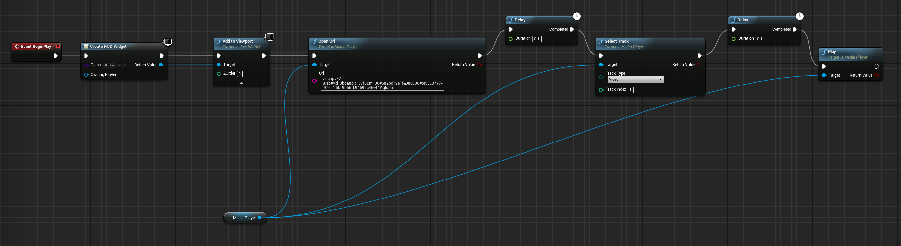

# UnrealEngine-Webcam
A demo of using Unreal Engine to stream multiple web cameras.

## Reference
The project is following the step here: [https://docs.unrealengine.com/en-us/Engine/MediaFramework/HowTo/UsingWebCams](https://docs.unrealengine.com/en-us/Engine/MediaFramework/HowTo/UsingWebCams)

## Notes:
1. The Step 5 & 6 should be replaced by just draging the MediaPlayer texture onto the HUD Widget Blueprint. If following the original step 5 and 6, the image texture could only be material, and the mediaplayer texture can not be placed there.

2. When loading the web cameras, sometimes the default track is 1, which is black in the media player. To change this, use a delay. The blueprints is attached below.

Enjoy:) 
